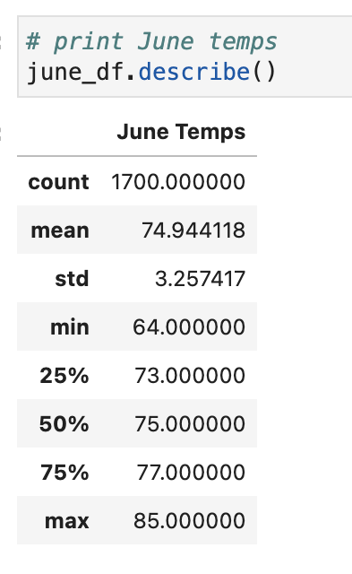
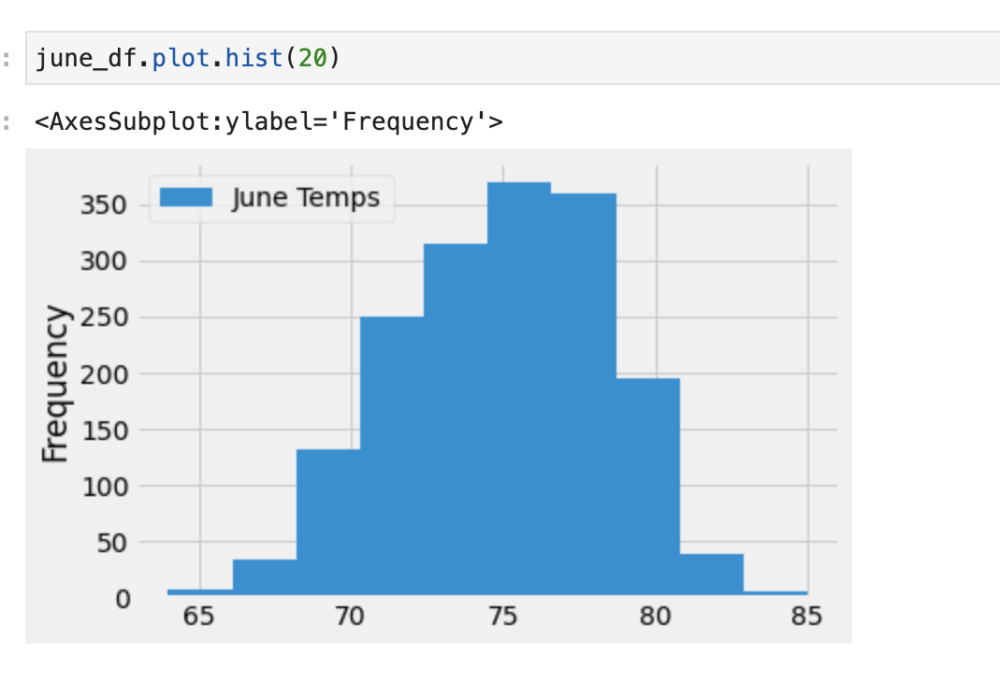
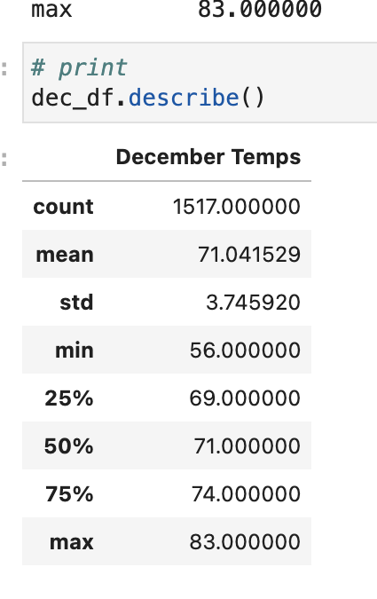
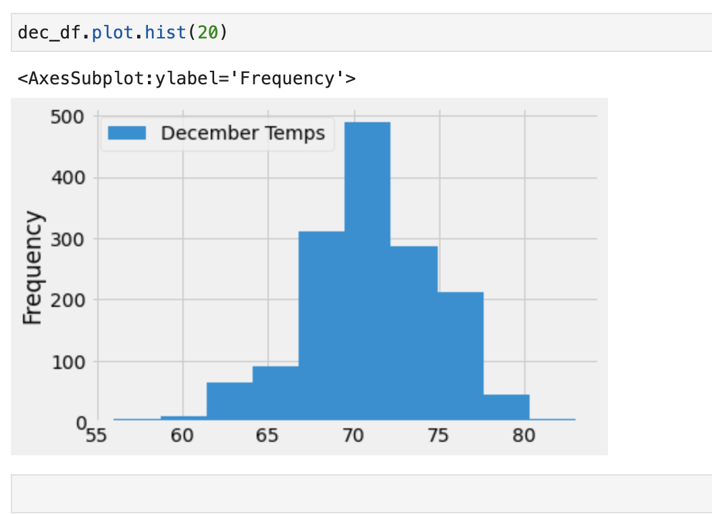

# surfs_up
## Background 
> The cliente wants more information about temperature trends before opening the surf shop. Specifically, he wants temperature data for the months of June and December in Oahu, in order to determine if the surf and ice cream shop business is sustainable year-round.

## Overview
> Deliverable 1: Determine the Summary Statistics for June
> Deliverable 2: Determine the Summary Statistics for December
> Deliverable 3: A written report for the statistical analysis (README.md)

## Resources
* Software: SQLlite, Python 3.9.2, Flask, Jupyter Notebook
* Data Tools: Python SQL (SQLALchemy), Object Relational Mapper, pandas, numpy, matplotlib
* Data Source: hawaii.sqlite
### Deliverable 1:
> 1. Write a query that filters the date column from the Measurement table to retrieve all the temperatures for the month of June.
> 2. Convert the June temperatures to a list.
> 3. Create a DataFrame from the list of temperatures for the month of June.
> 4. Generate the summary statistics for the June temperatures DataFrame.

### Deliverable 2:
> 1. Write a query that filters the date column from the Measurement table to retrieve all the temperatures for the month of December.
> 2. Convert the December temperatures to a list.
> 3. Create a DataFrame from the list of temperatures for the month of December.
> 4. Generate the summary statistics for the December temperatures DataFrame.

## Results
1. The average temperature for the month of June is 75F and for December is 71F. Only a 4 degree difference.
2.  The minimun temperature for the month of June is 64F and for December is 56F. However, the maximun temperature for the month of June is 85F and for December is 83F, a difference of only 2 degrees. 
3. The standard deviation for the month of December is 0.49 greater than the month June. Therefore, the temperatures recorded in December have a wider distribution than the month of June. 

## Summary

With the data provided and the DataFrames created we can establish that tempeartures do not vary greatly between the months of June and December. Therefore, the weather conditions are appropriate for a a surf and ice cream shop to open year round.

1. I would like to create a summary statistics of temperatures per station for the month of June and December. This will help determine if the temperatures vary greatly by station and if so which station has the optimal temperature year round.
2. Second, I would like to review other variables that can help to determine optimal beach, surfing and Ice cream conditions.These variables are and not litmited to precipitation, wave swells, wind condition and water temperature.
3. Third, it's important to acknowledge that foot traffic for sun bathers and beach goers might be different than the foot traffic brought by surfers.Therefore it would be ideal to establish key indicators that correlate with high foot traffic by surfers and regular beach goers.
